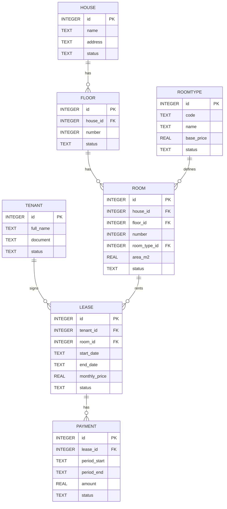

# Modelo de Base de Datos (SQLite) — Sistema de alquiler mensual

Descripción: Esquema adaptado a SQLite para el sistema de alquiler mensual (2 casas, 3 pisos por casa, 5 cuartos por piso). Incluye columnas `status` en todas las tablas y un diagrama ER en Mermaid.

---

Nota: activar claves foráneas en SQLite al abrir la DB:

```sql
PRAGMA foreign_keys = ON;
```

---

## Esquema SQL (SQLite)

```sql
-- Casas
CREATE TABLE house (
  id INTEGER PRIMARY KEY AUTOINCREMENT,
  name TEXT NOT NULL,
  address TEXT,
  status TEXT NOT NULL DEFAULT 'active' CHECK(status IN ('active','inactive')),
  created_at TEXT DEFAULT (datetime('now'))
);

-- Pisos
CREATE TABLE floor (
  id INTEGER PRIMARY KEY AUTOINCREMENT,
  house_id INTEGER NOT NULL,
  number INTEGER NOT NULL,
  description TEXT,
  status TEXT NOT NULL DEFAULT 'active' CHECK(status IN ('active','inactive')),
  FOREIGN KEY (house_id) REFERENCES house(id) ON DELETE CASCADE
);

-- Tipos de cuarto
CREATE TABLE room_type (
  id INTEGER PRIMARY KEY AUTOINCREMENT,
  code TEXT UNIQUE NOT NULL,
  name TEXT NOT NULL,
  description TEXT,
  status TEXT NOT NULL DEFAULT 'active' CHECK(status IN ('active','inactive')),
  base_price REAL NOT NULL
);

-- Cuartos
CREATE TABLE room (
  id INTEGER PRIMARY KEY AUTOINCREMENT,
  house_id INTEGER NOT NULL,
  floor_id INTEGER NOT NULL,
  number INTEGER NOT NULL,
  code TEXT,
  room_type_id INTEGER NOT NULL,
  area_m2 REAL,
  status TEXT NOT NULL DEFAULT 'available' CHECK(status IN ('available','occupied','maintenance')),
  created_at TEXT DEFAULT (datetime('now')),
  UNIQUE (house_id, floor_id, number),
  FOREIGN KEY (house_id) REFERENCES house(id) ON DELETE CASCADE,
  FOREIGN KEY (floor_id) REFERENCES floor(id) ON DELETE CASCADE,
  FOREIGN KEY (room_type_id) REFERENCES room_type(id)
);

-- Inquilinos
CREATE TABLE tenant (
  id INTEGER PRIMARY KEY AUTOINCREMENT,
  full_name TEXT NOT NULL,
  document TEXT,
  phone TEXT,
  email TEXT,
  status TEXT NOT NULL DEFAULT 'active' CHECK(status IN ('active','inactive')),
  created_at TEXT DEFAULT (datetime('now'))
);

-- Contratos / Alquileres (mes a mes)
CREATE TABLE lease (
  id INTEGER PRIMARY KEY AUTOINCREMENT,
  tenant_id INTEGER NOT NULL,
  room_id INTEGER NOT NULL,
  start_date TEXT NOT NULL, -- ISO: 'YYYY-MM-DD'
  end_date TEXT, -- NULL = abierto
  monthly_price REAL NOT NULL,
  deposit REAL,
  status TEXT NOT NULL DEFAULT 'active' CHECK(status IN ('active','terminated','pending')),
  created_at TEXT DEFAULT (datetime('now')),
  FOREIGN KEY (tenant_id) REFERENCES tenant(id),
  FOREIGN KEY (room_id) REFERENCES room(id)
);

-- Pagos mensuales
CREATE TABLE payment (
  id INTEGER PRIMARY KEY AUTOINCREMENT,
  lease_id INTEGER NOT NULL,
  period_start TEXT NOT NULL,
  period_end TEXT NOT NULL,
  amount REAL NOT NULL,
  paid_at TEXT,
  method TEXT,
  status TEXT NOT NULL DEFAULT 'pending' CHECK(status IN ('pending','paid','overdue')),
  created_at TEXT DEFAULT (datetime('now')),
  FOREIGN KEY (lease_id) REFERENCES lease(id)
);

-- Índices recomendados
CREATE INDEX idx_room_house_floor ON room(house_id, floor_id);
CREATE INDEX idx_lease_room ON lease(room_id);
CREATE INDEX idx_lease_tenant ON lease(tenant_id);
CREATE INDEX idx_payment_lease_period ON payment(lease_id, period_start);
```

---

## Ejemplos de datos (SQLite)

```sql
-- Tipos de cuarto
INSERT INTO room_type(code, name, base_price) VALUES
('S','Pequeño',150.00),
('M','Mediano',250.00),
('L','Grande',350.00);

-- Casas
INSERT INTO house(name, address) VALUES ('Casa 1','Dirección 1'),('Casa 2','Dirección 2');

-- Pisos (crear 3 pisos por casa)
INSERT INTO floor(house_id, number) VALUES
(1,1),(1,2),(1,3),(2,1),(2,2),(2,3);

-- Ejemplo: crear cuartos (por cada piso 5 habitaciones)
-- Repetir o generar con script externo; ejemplo para house 1, floor 1
INSERT INTO room(house_id, floor_id, number, code, room_type_id, area_m2) VALUES
(1,1,1,'H1-F1-R1',1,12.5),(1,1,2,'H1-F1-R2',1,11.0),(1,1,3,'H1-F1-R3',2,18.0),(1,1,4,'H1-F1-R4',2,20.0),(1,1,5,'H1-F1-R5',3,28.0);
```

---

## Diagrama ER (Mermaid)



---

## Notas y recomendaciones

- SQLite almacena fechas como TEXT en formato ISO (`YYYY-MM-DD` o `YYYY-MM-DD HH:MM:SS`).
- Activar `PRAGMA foreign_keys = ON;` en la conexión para que las FK funcionen.
- Las comprobaciones `CHECK` ayudan a normalizar `status`, pero SQLite permite valores fuera de la lista si se omite la comprobación; revisa según necesidades.
- Si quieres, genero un archivo `.sql` listo para ejecutar o un pequeño script Python/Node que inicialice la DB con los datos de ejemplo.

---

Fin del archivo.
